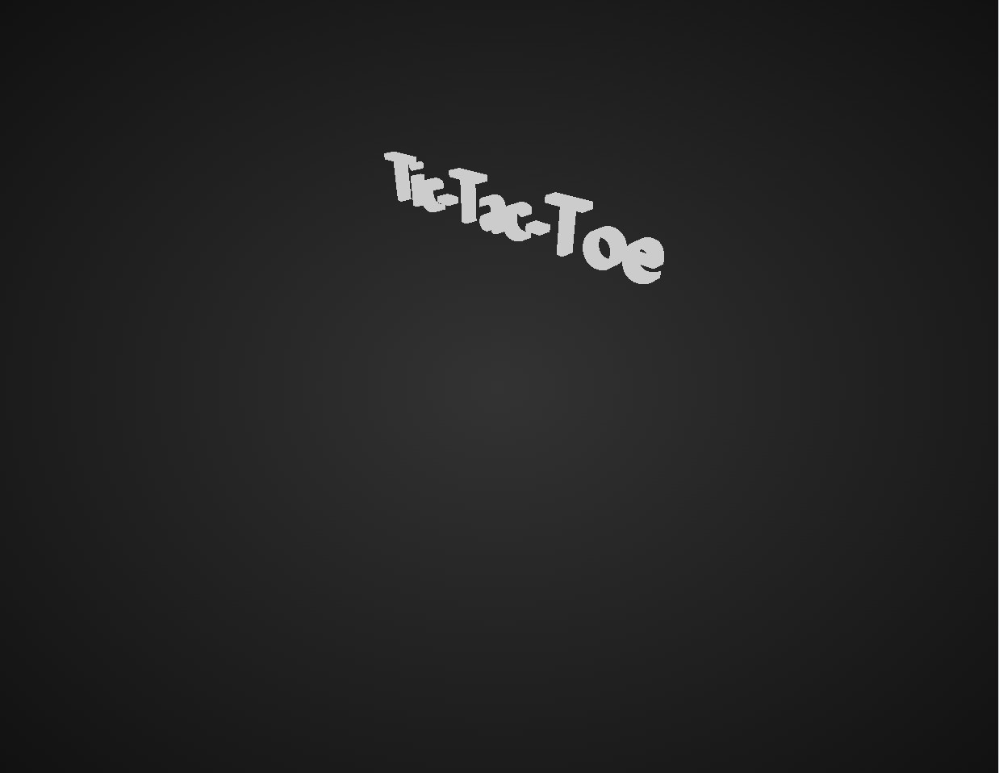
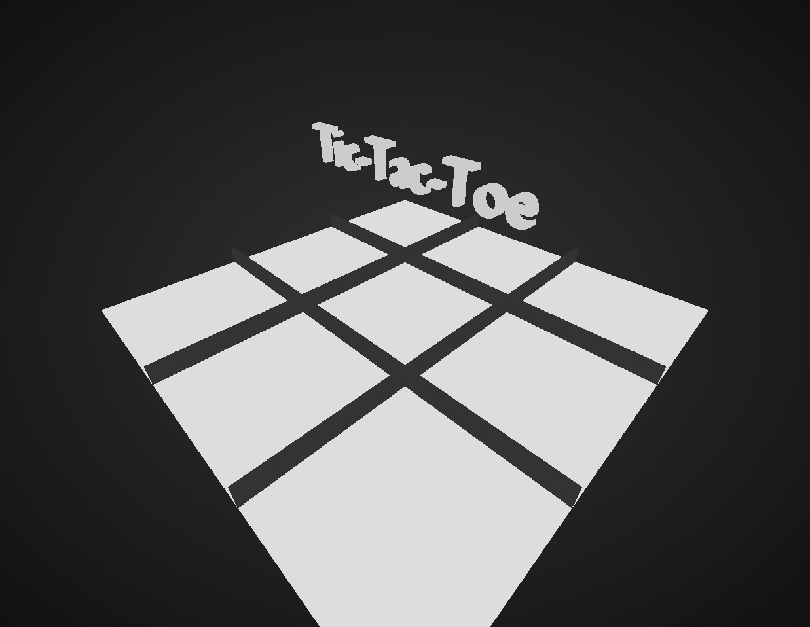
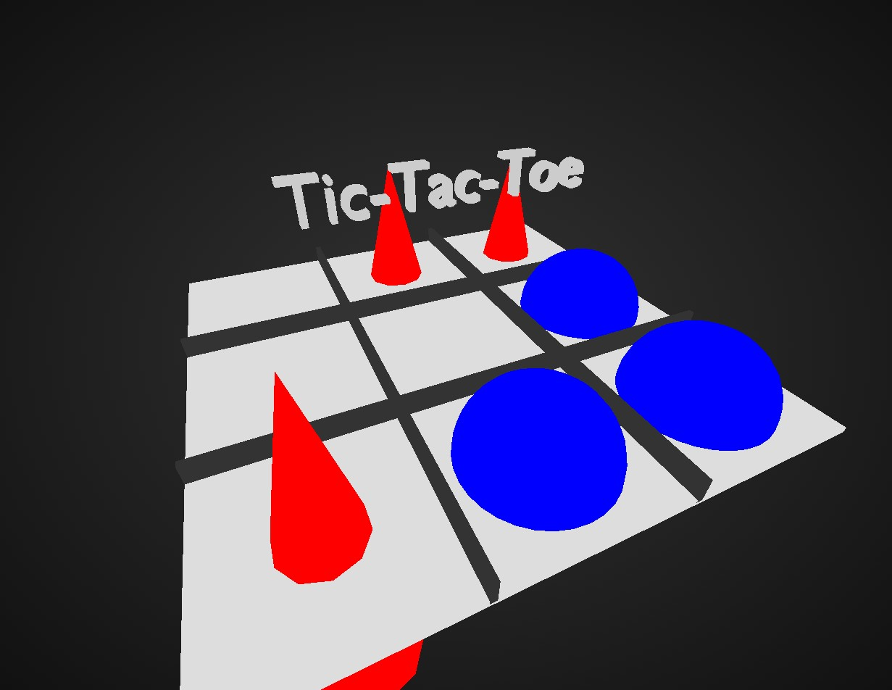
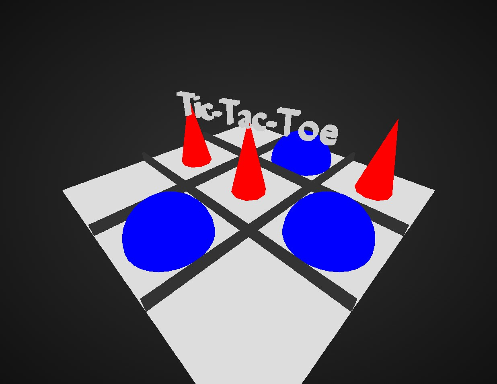
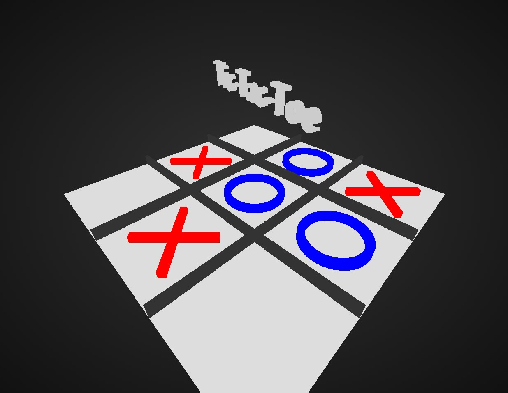

# Chapter 5

TicTacToeをThree.jsで作るサンプル

注意: それ以後のお題のために途中まで書かれたコードがあります。
このコードで出ているエラーはお題のコードを埋めても消えない場合がありますが、無視しても動くはずです。

自分が書いたコードで出ているエラーはちゃんと直してください。

最初の画像

## 1

TicTacToeのボードを作る。
イメージとしては↓のような感じ

一番下にサイズ9x9の平たい板
tic tac toeのために3x3に区切る壁4つ 全部直方体
詳しいサイズは↓ これ通りに配置しないと今後のクリック判定がバグります

Sceneに直接追加
- board
  - サイズ: 9 x 0.1 x 9
  - 色: 0xdddddd
  - 位置: (0, 0.05, 0)

boardの子要素として追加
- wall1
  - サイズ: 9 x 0.4 x 0.1
  - 色: 0x333333
  - 位置: (0, 0.2, 1.5)
- wall2
  - サイズ: 9 x 0.4 x 0.1
  - 色: 0x333333
  - 位置: (0, 0.2, -1.5)
- wall3
  - サイズ: 0.1 x 0.4 x 9
  - 色: 0x333333
  - 位置: (1.5, 0.2, 0)
- wall4
  - サイズ: 0.1 x 0.4 x 9
  - 色: 0x333333
  - 位置: (-1.5, 0.2, 0)

これをstage.tsの所定の位置に書きましょう

マテリアルはMeshBasicMaterial(べた塗)を使っておくと無難です。それ以外のマテリアルを使う場合、ライトが必要になることがあります。

全てのオブジェクトを生成したのち、クリック判定コードのコメントアウトを外しましょう

# 2

球や円柱、三角錐など好きな図形をクリックしたら配置するようにしましょう。
Three.jsが用意している図形は↓です。ジオメトリをカスタムします。

https://threejs.org/manual/#en/primitives

図形の配置はstage.ts内のplaceMarkerModelメソッドで配置しています。元となるGroupをcloneすることでメッシュを配置していきます。図形の形状によっては配置するときのy座標を変える必要があるかもしれません。

クローン元となるメッシュをstage.tsのコンストラクタ内の所定の位置で準備しましょう。

# 3

tic-tac-toeというモデルがボードの上に浮かんでいると思います。
アニメーションさせてみましょう。

回転させる。スケールを変えてみる、上下左右に動かす。何でもよいです。

アニメーションはレンダリング直前にやります。title.ts内のupdateメソッドはページを開いてからの**ミリ秒**を引数に取るので、それを使ってthis.model.position, this.model.scale, this.model.rotation等を変更してアニメーションさせましょう。sin関数やcos関数をうまい事使うとループアニメーションに出来るかもしれません。

# 4

#2 では好きな図形を配置しましたが、three.jsが元から用意している形状しか使えませんでした。モデルを読み込んでみましょう。

モデルの読み込みはtitle.tsでタイトル文字の読み込みが行われています。それを参考にして、src/models/circle.glbやsrc/models/cross.glbを読み込んでテンプレートとして保存してみましょう。

# 5

改造してみましょう。
改造案を書いておきます。

- いつゲーム終了したかを分かるようにしてみましょう
- ポストプロセシングを掛けてみましょう
- オブジェクトが配置される時にアニメーションさせてみましょう
- カーソルを合わせたときに配置のプレビューを出してみましょう
